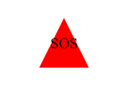

# 10-Object-oriented-Programming-SVG-Logo-Maker

## user story

AS a freelance web developer
I WANT to generate a simple logo for my projects
SO THAT I don't have to pay a graphic designer

## Description 

Logo Generator Application
- A command-line tool for creating simple logos.
- Designed for freelance developers to generate logos without external graphic design resources.
- Uses SVG.js library to create customizable logos based on user input.

## Key Features

User Input Interaction:
- Prompts users to input text, text color, shape, and shape color.
- Allows entry of up to three characters for text.
- Accepts color keywords or hexadecimal codes for specifying colors.

Shape Customization:
- Offers choice between circle, triangle, and square shapes.
- Shapes can be filled with selected colors.

SVG Logo Generation:
- Generates an SVG file named logo.svg based on user specifications.
- Places text inside the chosen shape at its center for visual appeal.

Node.js Environment Compatibility:
- Developed to function within a Node.js environment.
- Utilizes libraries suitable for SVG manipulation in a server-side context.

Simplified Logo Creation:
- Provides a straightforward method for developers to create basic logos.
- Eliminates the need for advanced graphic design tools or skills.

## screenshots & video

https://drive.google.com/file/d/1qb9b8tRBvTOT26oJOtp-9AYcc_hRMMuB/view

## deployment link

https://yasirjamah123.github.io/10-Object-oriented-Programming-SVG-Logo-Maker/

